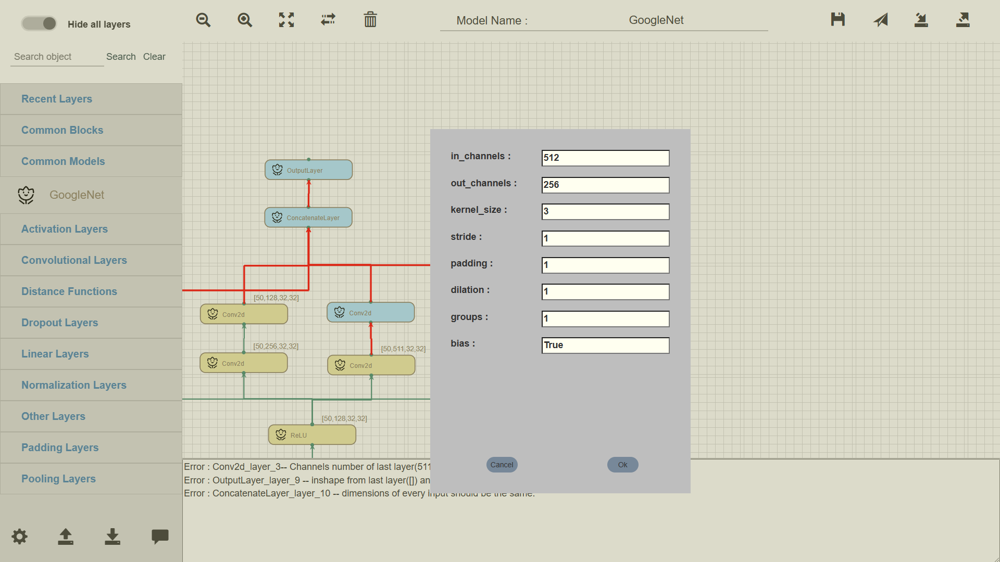

>   18 年花一个月做的东西，现学现做，现在也忘光了，纯当玩具了。
> 项目设计、实现等所有工作个人完成。
> 下载后，右键用 chrome 打开 index.html。

# 项目概览

## 需求

基于 `Pytorch` 框架，进行封装，以前端网页的形式，以拖拽连线的操作模式，完成神经网络可视化编程系统。

## 项目实现步骤

1. 进行前端网页布局设计，设计系统主体功能的框架，要支持哪些功能，以什么样的形式进行展现
2. 针对各部分功能模块，进行前端样式设计，以及功能实现，并逐步接入整体框架（在实际实现中，可以适当调整完善）
3. 进行最后的同一优化调度

## 系统主要功能

可以以 `Chrome` 打开 `src` 路径下的 `index.html` 文件，从而打开系统，进行体验。

## 源码结构

源码分为以下部分：

### index.html

项目主体页面，为项目的骨架。其结构详见源码。主要分为左右两部分，流式布局。详细结构和功能，见注释部分。

### css

**main_layout.css**

项目主体的布局样式设计，详细见源码注释部分。

### js（核心部分）

**main_layout.js**

系统主体的 js 框架代码。

**Check_Type.js**

用于每个网络层的参数检查的 `js` ，主要用到正则表达式，进行参数匹配。

可以双击软件界面的某个网络层，将会弹出一个参数输入界面，每一个参数输入框，都会提示支持类型，并在点击确认时，自行匹配是否合法。

**file_operation.js**

用于文件相关操作的脚本，包括模型导入导出，代码生成，模型保存复用等等，详见代码及注释。

**Layer_list_Creation.js**

左侧网络层，组件等列表创建，更新，搜索等功能实现。

**model_Design.js**

模型绘制的相关操作，包括网络层创建，拖拽，连线等等，内容较多，详见代码及注释。

**model_management.js**
已绘制模型的保存与加载等操作，详见代码及注释。

**params_management.js**
网络层参数填写和更新，以及参数验证，和网络层之间，自动匹配查错等等。

**pyTorch_CodeGen.js**
Pytorch 代码生成等操作。

### lib

第三方的一些库，直接使用即可。最好不要更该版本，可能会出现一些不兼容，导致软件使用不正常。

### resources

一些前端样式用到的图片，背景等等。

# 一些其他信息

## 数据接口

### Layers 相关 metaData
    目前而言，对于 layer 均为预置，不可更改。每个种类的 layer 封装于一个 metaData 结构中。各个 metaData 的结构一致，均为数组。  
    
    第一个元素为 metaData 相关的基本信息，详见代码。其他部分每个元素为一个层。在每个层结构中，包含该层的相关信息以及参数信息，此外还有一些函数接口。所有层结构的内部对应元素的 key 都相同，不过值不同而已。详见代码。  
    
    最后为了便于遍历自动化等操作，将所有的 metaData 名存储于一个数组中，即：Layers_metaData_Collection，通过 window[metaData_name] 可以获取对应的数据结构。因此，便于便利时自动化。

**注意**

    在 metaData 中的所有 key 不要随便修改，因为代码其他部分会用到。对于新拓展的层只需要按照固定格式添加即可。如果需要对每层添加新的属性，可能需要在代码其他部分进行更改。

### Blocks 相关 metaData

    与 layers 不同，blocks 对应的 metaData 数据可能会在用户使用过程中进行更改，因为用户可能会添加或删除新的 block。  
    
    因此，目前的实现中，在第一次加载过程中，会将预置的 blocks 对应的 metaData 写入 localStorage。其后，会直接通过 localStorage 进行访问。  
    
    目前所有的 blocks 存放于一个标签页下，所以不需要数组进行统筹遍历，直接调用即可。

### Modules 相关 metaData

    与 layers modules 对应的 metaData 数据可能会在用户使用过程中进行更改，因为用户可能会添加或删除新的 modules。  
    
    因此，目前的实现中，在第一次加载过程中，会将预置的 modules 对应的 metaData 写入 localStorage。其后，会直接通过 localStorage 进行访问。  
    
    目前所有的 modules 存放于一个标签页下，所以不需要数组进行统筹遍历，直接调用即可。

## 功能描述

### 列表动态创建

#### 初始化列表的动态创建

    layers 直接从 js 文件中读取数据然后动态创建即可。  
    
    blocks 和 modules 则需要从 localStorage 中进行读取创建。

#### recent layers 列表的动态创建

    recent layers 只包含 layers 部分，blocks 和 modules 不参与。用户第一次加载时，将会默认提供 12 个层。recent layers 的动态创建包含两部分，一个是包含所有层及其权值参数的结构，设为 A； 另一个是只包含 12 个层及其权值的结构，设为 B。所有层的默认权值为 0，且 AB 相同层的权值同步。  
    
    当用户拖拽某一层时到绘图区时，将会执行如下几步：
    1. 在 A 中更新该层的对应权值
    2. 在 B 中查找该层，若找到，则更新该层在 B 中对应的权值
    3. 若未找到，则查找 B 中权值最低的层 l1，并将其与所查找的层 s2 的权值进行对比
    4. 若 s1 > s2，则不变；否则，在 recent layers 列表中删除 s1，并用 s2 插入到对应位置
    5. 重新创建 recent layers

#### 搜索列表的创建

    搜索列表需要对所有 metaData 进行搜索。通过正则匹配，搜索包含输入字符串的的所有 layers 或 blocks 或 modules 。若无结果，会提示；若搜索到结果，则将所有符合要求的结果动态创建列表。

### 参数表单部分

    可视化中，一个很关键的部分就是参数表单的处理。由于每个层实例对应一个参数列表，所以这里采用直接将参数以字符串形式（json）存储于层实例中的一个隐藏 div 中，通过它做参数的交互。
    
    首先，在创建层实例的时候，现访问 metaData 对应的层定义，来生成一个包含完整信息的 json，其中 param 字段包含所有参数。这种方式与层无关，但是需要针对 layer 和 blocks 以及 modules 这三类分别编写解析代码，但对于每一类下的不同小的类别，格式定义一致。

#### 参数初始化

    在层实例创建时，会根据默认参数，填充对应 div 的 params 字段，并进行保存。

#### 表单填写

    当双击层实例时，会弹出参数表单，该表单动态创建，对于所有类别一样，只需要包含 params 字段，并且每个参数包含 type 和 value 字段即可。  
    
    表单创建的思路是，读取当前双击的层实例的 id，然后读取其 描述部分的 div，读取 params 字段，并遍历所有参数，然后动态创建表单即可。

#### 参数更新

    当点击表单的 ok 按钮时，需要进行参数更新。  
    
    首先需要获取该表单填写的数据，然后获取该层实例的原始数据，并用表单数据替换层实例数据，然后在保存到对应的 div html 部分。

# UI

demo，所以不涉及 UI，主界面如下：

